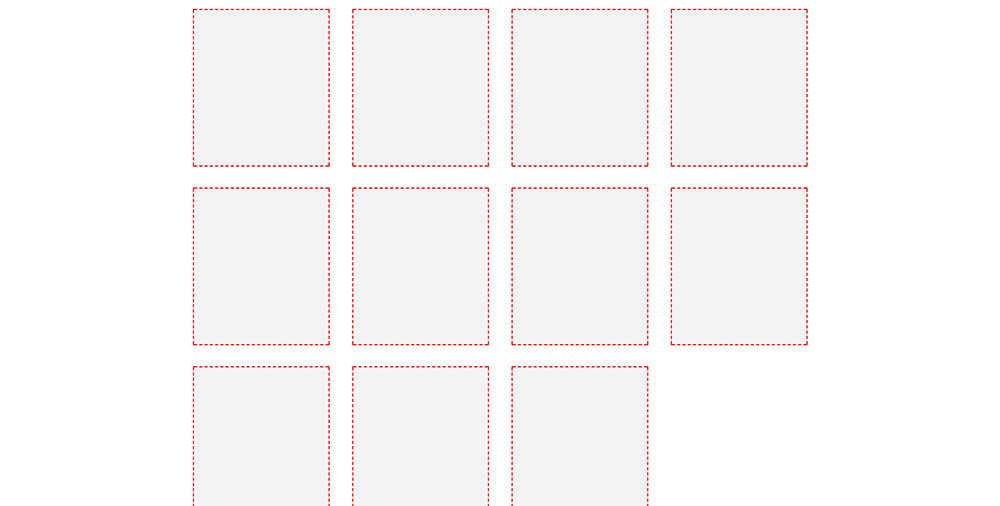

# LayoutBox - css library of templates

### Description

	Attention! it based on flex technology.

### Classes

to position elements inside a container:

- **--row** - defines internal elements as columns
- **--row-(2-6)** - divides internal elements on equal columns
- **--col** - places elements in a vertical column
- **--left** - places internal elements to the left
- **--right** - places internal elements to the right
- **--bottom** - places internal elements to the bottom
- **--center** - places internal elements to the center
- **--around** - places internal elements of the block evenly
- **--between** - places internal elements across the entire width of the block

dividing classes:

- **--tile-(3,4)** - converts the internal elements of a block to a tile
- **--grid-(2-6)** - converts the internal elements of a block to a grid

classes for containers (with padding-left-right 15px) :

- **_container** - max width 1200px
- **_container-hd** - max width 1280px
- **_container-thin** - max width 1024px

classes affect the size of the blocks:

- **_screen** - stretches the element to full screen
- **_full** - stretches the element to full parent block

additional class:

- **_trans-250** - assigns the transition property
- **_trans-500**
- **_trans-250-full** - assigns the transition property to all child elements and subelements
- **_trans-500-full**
- **_icon-left** - addes left space for the icon

if you need to hide a block on a specific resolution:

- **_hide-1024**
- **_hide-768**
- **_hide-420**

css classes divided on:

- **positional** (start with "--") - use only for positioning elements
- **global** (start with "_") - allows you to customize common element styles
- **decorators** (starting with "-" ) - are used to change certain properties of the element
- **simple** - user-defined classes. You can use class inheritance and overload


### Exapmles

```html
<div class="_cont">
	<div class="--left --center">
		<div class="some"></div>
		<div class="some"></div>
		<div class="some"></div>
	</div>
</div>

<div class="_cont">
	<div class="product-list --tile-4">
		<div class="product"></div>
		<div class="product"></div>
		<div class="product"></div>
		<div class="product"></div>
		<div class="product"></div>
		<div class="product"></div>
		<div class="product"></div>
	</div>
</div>

```



-------------
Thank's for using.
Developed by Ustinov Maxim - [ewclide](http://vk.com/ewclide)